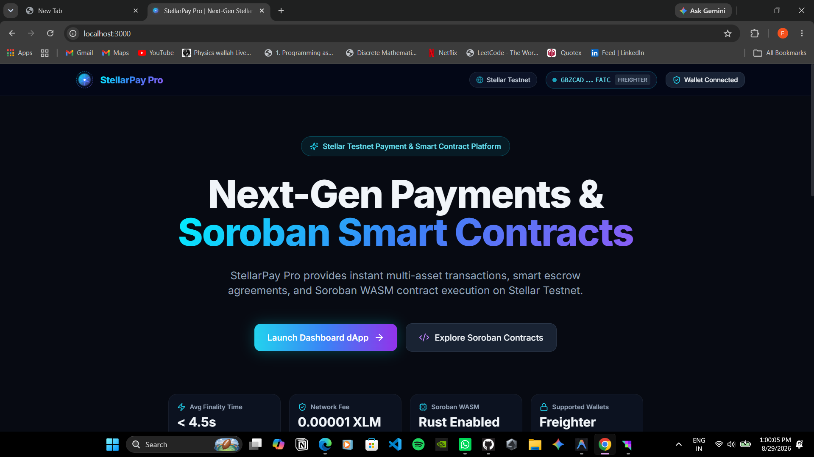
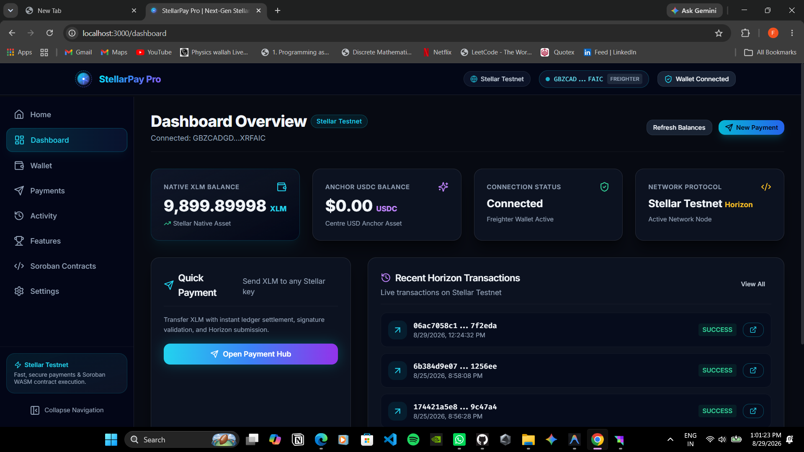
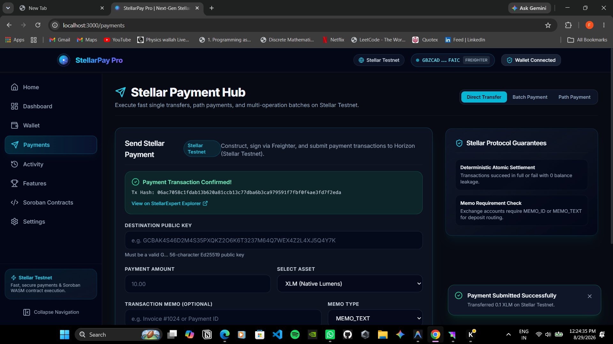
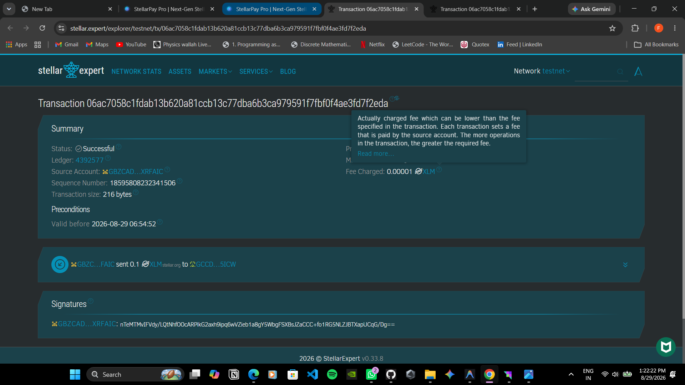

# StellarPay Pro 🚀

> Next-Generation Stellar Payments & Soroban Smart Contract Payment Tracker dApp.


---

## 🌟 Overview

**StellarPay Pro** is a high-performance Web3 financial application built on top of the Stellar Network and Soroban smart contract ecosystem. Designed with sleek dark glassmorphism, strict decoupled architecture, and real-time Horizon REST & Soroban RPC node synchronization.

StellarPay Pro combines instant Horizon XLM payments with immutable on-chain payment record tracking powered by a deployed Rust Soroban smart contract on Stellar Testnet.

---

## ✨ Key Features

- **StellarWalletsKit Multi-Wallet Integration**: Unified wallet connector supporting 6 major Stellar wallets (Freighter, Albedo, xBull, Rabet, Lobstr, Hana) with direct native Freighter fallback.
- **Horizon XLM Payment Hub**: Construct, simulate, sign, and submit real XLM payments to Stellar Testnet with custom memos (`MEMO_TEXT` or `MEMO_ID`).
- **Deployed Soroban Smart Contract**: Integrated Payment Tracker smart contract deployed on Stellar Testnet.
- **On-Chain Payment Logging (`record_payment`)**: Auto-records payment metadata (sender, recipient, amount in stroops, memo) to Soroban persistent contract storage.
- **Instant State Queries (`get_payment` & `get_payment_count`)**: Real-time read-only RPC simulation querying contract storage without requiring wallet signatures or gas fees.
- **Typed Error Engine**: Specialized error classification separating `WalletNotFoundError`, `UserRejectedError`, and `InsufficientBalanceError` with pre-flight balance validations.
- **Cryptographic Hash Feedback**: Displays explorer-verifiable transaction hashes for both Horizon payments and Soroban contract calls with direct StellarExpert Explorer links.

---

## 🏗️ Architecture & Stellar Protocol Design

### Why Two Wallet Approvals Are Required for Payments

When sending a payment on StellarPay Pro, the workflow executes two distinct steps:
1. **Step 1**: Native XLM Payment Transfer submitted to Horizon.
2. **Step 2**: Payment metadata recording (`record_payment`) invoked on the Soroban smart contract.

#### Protocol-Level Architectural Reason
Under **Stellar Core Protocol Specification (CAP-0046)**:
- **Soroban RPC Constraint**: Soroban RPC node `simulateTransaction` and `prepareTransaction` enforce that any transaction containing a Soroban host invocation (`InvokeHostFunction`) MUST contain **exactly one operation**.
- **Stellar Core Envelope Constraint**: Combining classic Horizon payment operations (`Operation.payment`) and Soroban smart contract invocations (`Operation.invokeHostFunction`) in the same transaction envelope is rejected by Stellar Core with `tx_malformed`.
- **Contract Security Constraint**: The deployed Rust Soroban contract enforces `from.require_auth()`, requiring cryptographic signature authorization from the sender's account keypair.

Therefore, StellarPay Pro uses a **Two-Transaction Architecture**:
- **Signature 1**: Signs the Horizon XLM transfer transaction envelope.
- **Signature 2**: Signs the Soroban contract invocation transaction envelope.

The UI provides step-by-step progress banners and handles rejections gracefully without losing payment state.

---

## 🛠️ Technology Stack

- **Frontend**: React 18 + Vite
- **Language**: TypeScript (Strict mode enabled, 0 type errors)
- **Styling**: Tailwind CSS + Vanilla CSS Glassmorphism + Lucide React Icons
- **State Management**: Zustand
- **Routing**: React Router DOM v6
- **Smart Contract**: Rust (`soroban-sdk` v21.7.7, `wasm32v1-none`)
- **Stellar SDKs**:
  - `@stellar/stellar-sdk` (v13.0.0)
  - `@creit.tech/stellar-wallets-kit` (v2.5.0)
  - `@stellar/freighter-api` (v2.0.0)
- **Testing & Quality**: Vitest (21 unit tests passing), ESLint 9 (0 errors)

---

## 🌐 Network Configuration

- **Network**: Stellar Testnet
- **Network Passphrase**: `Test SDF Network ; September 2015`
- **Horizon Node URL**: `https://horizon-testnet.stellar.org`
- **Soroban RPC URL**: `https://soroban-testnet.stellar.org`
- **Explorer URL**: `https://stellar.expert/explorer/testnet`

---

## 📜 Deployed Soroban Smart Contract Details

- **Contract Name**: Payment Tracker (`payment_tracker`)
- **Deployed Contract ID**:
  ```text
  CBNFYYS23WL3CT6H7O2KVOY3OO2AXYZPXBZTID6SHXZMW55IFVGCQEE7
  ```
- **WASM Hash**: `d56e0df028d876e75c3de8248364fd2fe1779e9a8a581750b275bec8e7f512df`
- **Contract Address on Explorer**: [View on StellarExpert](https://stellar.expert/explorer/testnet/contract/CBNFYYS23WL3CT6H7O2KVOY3OO2AXYZPXBZTID6SHXZMW55IFVGCQEE7)

### Contract ABI & Functions

1. **`record_payment(from: Address, to: Address, amount: i128, memo: String) -> u64`**
   - **Type**: Mutative (Requires Auth via `from.require_auth()`)
   - **Description**: Records payment details in contract persistent storage, increments total payment count, and emits a Soroban contract event (`payment_recorded`).
2. **`get_payment(payment_id: u64) -> Option<PaymentRecord>`**
   - **Type**: Read-Only (RPC simulation, 0 gas, 0 auth)
   - **Description**: Retrieves a stored payment record by numeric ID. Returns `sender`, `recipient`, `amount` (in stroops), `memo`, and `timestamp`.
3. **`get_payment_count() -> u64`**
   - **Type**: Read-Only (RPC simulation, 0 gas, 0 auth)
   - **Description**: Returns the total number of payment transactions recorded on-chain.

---

## 🔗 On-Chain Verification Examples

Live verified transactions on Stellar Testnet for contract `CBNFYYS23WL3CT6H7O2KVOY3OO2AXYZPXBZTID6SHXZMW55IFVGCQEE7`:

- **Payment Record #1**:
  - **XLM Payment Hash**: `135d2996...`
  - **Sender**: `GBZCADGDL7NW5JL4JQY74RW3VOFK2GIO2TZU34LEGQCFVXR6CJXRFAIC`
  - **Recipient**: `GCCDE2EBAK5BBRWZMLZGYAK4P6JWYNY3KY5H6OXTH4JG6Y2POKBK5ICW`
  - **Amount**: `0.1000000 XLM` (`1000000 stroops`)
  - **Memo**: `Payment 135d2996`
- **Payment Record #2**:
  - **XLM Payment Hash**: `7971d0435cac2885bb0de1ed29bdedc6c568d2569076e00ac807c1ecf39f6773`
  - **Soroban Contract Hash**: `1025297d8199b71cbd3f21aad4e8b8554f621a21e7613a1450b8b5641f0428e1`
  - **Sender**: `GAZDKH2EONM3LZJKGVAG523LDH7LZVUYJWEH5WT6MVUEV5ECYI2XME2U`
  - **Recipient**: `GATQIOCRECKESCNH36O6AEYXTVKLQPTQZTZFHPRRBMT43DGF6E3P5GIA`
  - **Amount**: `0.1000000 XLM` (`1000000 stroops`)
  - **Memo**: `E2E Testnet Tx`

---

## 🚀 Local Setup Instructions

### Prerequisites

- **Node.js**: `v18.0.0` or higher
- **npm**: `v9.0.0` or higher
- **Freighter Browser Extension**: Installed in Chrome or Edge ([Get Freighter](https://www.freighter.app/))

### Installation & Launch

```bash
# 1. Clone the repository
git clone https://github.com/your-username/stellarpay-pro.git
cd stellarpay-pro

# 2. Install dependencies
npm install

# 3. Create local environment configuration
cp .env.example .env

# 4. Start local development server
npm run dev
```

The application will launch at `http://localhost:3000`.

---

## ⚙️ Environment Variables Configuration

Copy `.env.example` to `.env`:

```env
VITE_STELLAR_NETWORK=testnet
VITE_STELLAR_HORIZON_URL=https://horizon-testnet.stellar.org
VITE_STELLAR_NETWORK_PASSPHRASE=Test SDF Network ; September 2015
VITE_SOROBAN_RPC_URL=https://soroban-testnet.stellar.org
VITE_PAYMENT_TRACKER_CONTRACT_ID=CBNFYYS23WL3CT6H7O2KVOY3OO2AXYZPXBZTID6SHXZMW55IFVGCQEE7
VITE_APP_NAME=StellarPay Pro
VITE_APP_URL=https://stellarpay.pro
VITE_ENABLE_SOROBAN_CONTRACTS=true
VITE_ENABLE_BATCH_PAYMENTS=true
```

---

## 🧪 Development & Quality Commands

```bash
# Run local Vite development server
npm run dev

# Run TypeScript type checker (0 errors)
npm run typecheck

# Run ESLint linter (0 errors / 0 warnings)
npm run lint

# Run Vitest test suite (21/21 passing)
npm test

# Build production bundle
npm run build
```

---

## 🛡️ Security Considerations

- **Non-Custodial Design**: Private keys never leave the user's wallet extension. All transaction signing occurs inside Freighter/StellarWalletsKit.
- **Pre-Flight Validation**: Balances and destination addresses are validated before requesting wallet signatures to avoid unnecessary gas/fees or failed transaction logs.
- **Contract Authorization**: `record_payment` requires explicit `from.require_auth()` on-chain to prevent unauthorized record creation.
- **Environment Isolation**: No private keys or secret seeds are stored in code or repository configuration.

---

## ⚠️ Known Limitations

- **Stellar Testnet Friendbot Rate Limits**: Friendbot faucet requests may occasionally fail if rate limited; retry after a brief pause.
- **RPC Polling Delay**: Soroban transaction confirmation polling on RPC nodes takes ~2-4 seconds per block.

---

## 📸 Screenshots (Verification)

### 1. Wallet Connected State

*Displays truncated public key (G...), active provider badge, and network indicator.*

### 2. XLM Balance Display

*Live account XLM balance queried from Horizon Testnet REST API.*

### 3. Successful Testnet Transaction

*Successful Stellar Testnet XLM payment confirmation displaying the 64-character transaction hash, operation status, and direct StellarExpert Explorer link.*

### 4. Transaction Result & Failure Handling

*Payment form confirmation and resilient error handling for rejections or invalid transactions.*

---

## 📋 License

MIT © StellarPay Pro Team
