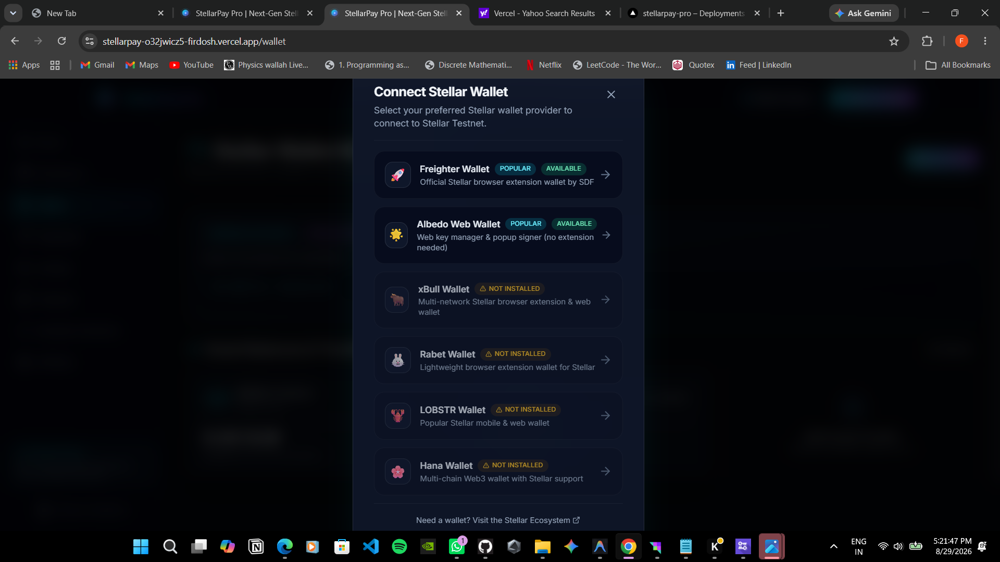
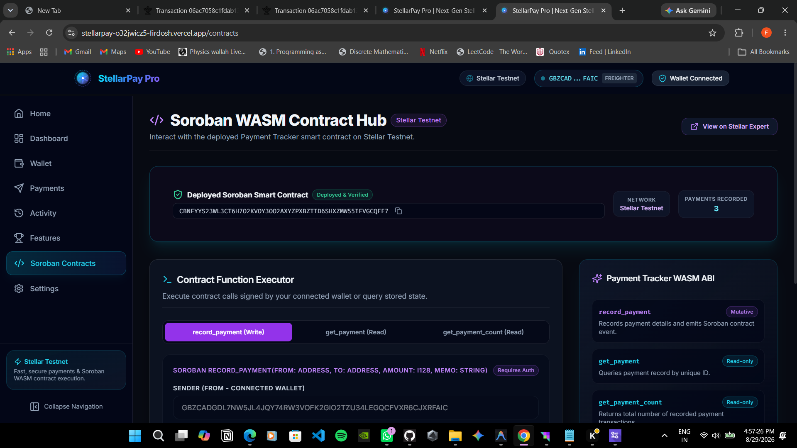
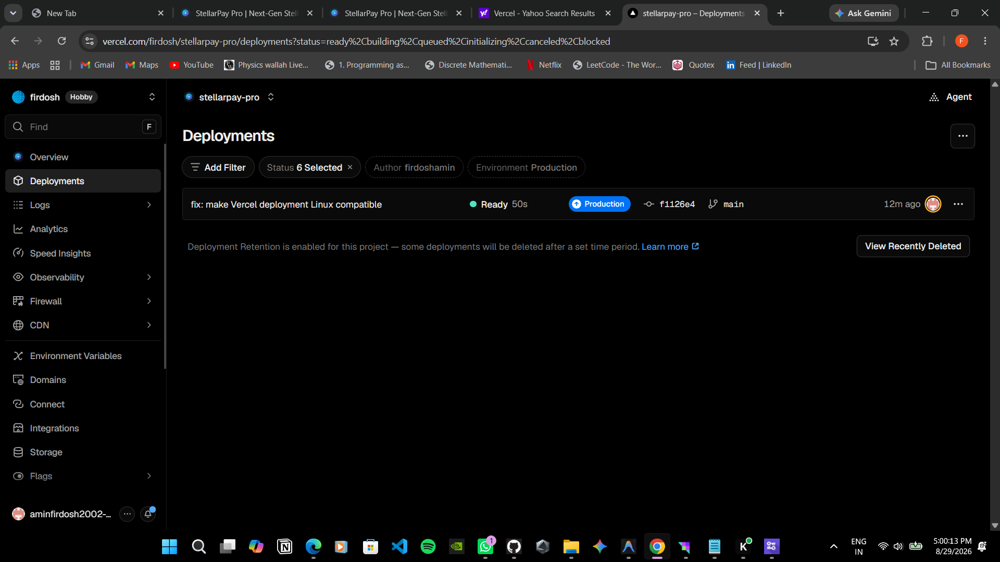

# StellarPay Pro 🚀 (Level 3 Upgrade)

> Next-Generation Stellar Payments & Soroban Smart Contract Payment Tracker dApp.


---

## 🌐 Live Demo

🔗 **Live Production URL**: [https://stellarpay-o32jwicz5-firdosh.vercel.app/](https://stellarpay-o32jwicz5-firdosh.vercel.app/)

---

## 🌟 Level 3 Overview

**StellarPay Pro Level 3** upgrades the production dApp with advanced smart contract capabilities, real-time Soroban RPC event polling, inter-contract communication, mobile-first responsive UX, automated GitHub Actions CI/CD workflows, and reproducible contract deployment automation.

---

## 🎥 Level 3 Demo Video

Demo video: [PASTE_YOUR_VIDEO_LINK_HERE]

---

## ✨ Key Features (Level 1, 2 & 3)

- **Advanced Payment Lifecycle Tracking**: Extended Soroban smart contract with status transitions (`0 = Pending`, `1 = Completed`, `2 = Refunded`, `3 = Disputed`).
- **Inter-Contract Communication**: Secondary `PaymentVerifierContract` demonstrating real Soroban contract-to-contract invocation (`record_via_verifier`).
- **Real-Time RPC Polling & Event Querying**: `LiveActivityFeed` component polling Soroban persistent contract storage and publishing live status badges (`Completed`, `Refunded`, `Disputed`).
- **StellarWalletsKit Multi-Wallet Integration**: Unified wallet connector supporting 6 major Stellar wallets (Freighter, Albedo, xBull, Rabet, Lobstr, Hana).
- **Horizon XLM Payment Hub**: Construct, simulate, sign, and submit real XLM payments to Stellar Testnet with custom memos.
- **Deployed Soroban Smart Contract**: Payment Tracker contract (`CC7B3N7DQRD5MGVLD2WPREA6CCTJJBAHSR2OCAOXQ5YIB4MS5TSV3UMV`) deployed on Stellar Testnet.
- **Mobile Responsive Frontend**: Fully responsive navigation drawer, mobile-friendly payment cards, scrollable contract tables, and touch-optimized buttons.
- **Automated CI/CD Pipeline**: GitHub Actions workflow under `.github/workflows/ci.yml` enforcing automated typechecking, linting, testing, and production builds.
- **Contract Deployment Automation**: Documented deployment pipeline under `.github/workflows/deploy-contract.yml`.

---

## 🏗️ Architecture & Protocol Specifications

### Inter-Contract Communication Architecture

StellarPay Pro implements real Soroban contract-to-contract invocation:
```text
[User / Frontend] ──> [PaymentVerifierContract] ──(client.record_payment)──> [PaymentTrackerContract] ──> [Persistent Storage]
```
1. Client calls `PaymentVerifierContract.record_via_verifier()`.
2. `PaymentVerifierContract` instantiates `PaymentTrackerContractClient` in Rust.
3. Invokes `record_payment` cross-contract, delegating authentication and persistent storage logging.

### Why Two Wallet Approvals Are Required for Payments

1. **Step 1**: Native XLM Payment Transfer submitted to Horizon.
2. **Step 2**: Payment metadata recording (`record_payment`) invoked on the Soroban smart contract.

Under **Stellar Core Protocol Specification (CAP-0046)**:
- **Soroban RPC Constraint**: Any transaction containing a Soroban host invocation (`InvokeHostFunction`) MUST contain **exactly one operation**.
- **Stellar Core Envelope Constraint**: Combining Horizon payments (`Operation.payment`) and Soroban host calls (`Operation.invokeHostFunction`) in one transaction envelope returns `tx_malformed`.

---

## 🛠️ Technology Stack

- **Frontend**: React 18 + Vite
- **Language**: TypeScript (Strict mode enabled, 0 type errors)
- **Styling**: Tailwind CSS + Vanilla CSS Glassmorphism + Lucide React Icons
- **State Management**: Zustand
- **Routing**: React Router DOM v6
- **Smart Contract**: Rust (`soroban-sdk` v21.7.7, `wasm32v1-none`)
- **Stellar SDKs**:
  - `@stellar/stellar-sdk` (v13.0.0)
  - `@creit.tech/stellar-wallets-kit` (v2.5.0)
  - `@stellar/freighter-api` (v2.0.0)
- **CI/CD**: GitHub Actions (Ubuntu)
- **Testing Suite**: Vitest (Frontend) + Cargo Test (Soroban Smart Contract)

---

## 🌐 Network Configuration

- **Network**: Stellar Testnet
- **Network Passphrase**: `Test SDF Network ; September 2015`
- **Horizon Node URL**: `https://horizon-testnet.stellar.org`
- **Soroban RPC URL**: `https://soroban-testnet.stellar.org`
- **Explorer URL**: `https://stellar.expert/explorer/testnet`

---

## 📜 Deployed Soroban Smart Contract Details

- **Contract Name**: Payment Tracker (`payment_tracker`)
- **Deployed Contract ID**:
  ```text
  CC7B3N7DQRD5MGVLD2WPREA6CCTJJBAHSR2OCAOXQ5YIB4MS5TSV3UMV
  ```
- **WASM Hash**: `11a553aac1844763e9730b3f5cedc35ceb5e3bbd74864ddde267acbf5298ccb1`
- **Contract Address on Explorer**: [View on StellarExpert](https://stellar.expert/explorer/testnet/contract/CC7B3N7DQRD5MGVLD2WPREA6CCTJJBAHSR2OCAOXQ5YIB4MS5TSV3UMV)

### Contract ABI & Functions

1. **`record_payment(from: Address, to: Address, amount: i128, memo: String) -> u64`**
2. **`update_payment_status(payment_id: u64, new_status: u32) -> bool`**
3. **`get_payment(payment_id: u64) -> Option<PaymentRecord>`**
4. **`get_payment_count() -> u64`**
5. **`PaymentVerifierContract.record_via_verifier(tracker: Address, from: Address, to: Address, amount: i128, memo: String) -> u64`**

---

## ⚙️ CI/CD & Deployment Workflows

### GitHub Actions CI/CD Pipeline (`.github/workflows/ci.yml`)
Runs automatically on `push` and `pull_request` to `main`, `level-3`, `level-2`:
- Runs TypeScript Typecheck (`npm run typecheck`)
- Runs ESLint Linter (`npm run lint`)
- Runs Vitest Unit Tests (`npm test`)
- Runs Production Build (`npm run build`)

### Soroban Smart Contract Deployment Workflow (`.github/workflows/deploy-contract.yml`)
Automated workflow for compiling WASM and deploying to Soroban networks:
1. Configure `STELLAR_ACCOUNT_SECRET` in GitHub Secrets.
2. Trigger manually via GitHub Actions workflow dispatch.

---

## ☁️ Vercel Deployment

StellarPay Pro is deployed on **Vercel**.
- **Deployment Platform**: Vercel
- **Production Build Command**: `npm run build`
- **Output Directory**: `dist`
- **Live URL**: [https://stellarpay-o32jwicz5-firdosh.vercel.app/](https://stellarpay-o32jwicz5-firdosh.vercel.app/)

---

## 🧪 Testing Commands & Validation Results

```bash
# 1. Run Soroban Rust Smart Contract Test Suite
cargo test --manifest-path contracts/payment_tracker/Cargo.toml
# Result: 4/4 PASSED (test_record_and_get_payment, test_update_payment_status, test_inter_contract_communication, test_record_zero_amount_panics)

# 2. Run TypeScript Type Checker (0 errors)
npm run typecheck

# 3. Run ESLint Linter (0 errors / 0 warnings)
npm run lint

# 4. Run Vitest Unit Test Suite (21/21 passing)
npm test

# 5. Run Production Bundle Build
npm run build
```

---

## 📸 Screenshots (Verification)

### 1. Wallet Connected State


### 2. Wallet Options (Multi-Wallet Integration)


### 3. XLM Balance Display


### 4. Payment Flow & Result Handling


### 5. Successful Stellar Testnet XLM Payment


### 6. Successful On-chain Transaction Confirmation


### 7. Soroban Smart Contract ID & On-chain Record Query


### 8. Vercel Production Deployment


---

## 📋 License

MIT © StellarPay Pro Team
